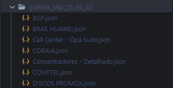

# Grafana Dashboards

> Backup de Dashboards do Grafana usando PHP
>
> O Script cria os arquivos os arquivos em JSON dentro de um diretório. Ex: grafana_bkp_25_06_22

> Quer dizer que o backup foi gerado dia 25/06/2022 :)

## Referências

[get UTC time in PHP](https://stackoverflow.com/questions/8655515/get-utc-time-in-php)
[CURL Converter to PHP](https://curlconverter.com/#php)
[PPH DOC - mkdir](https://www.php.net/manual/pt_BR/function.mkdir.php)
[stackoverflow - How to generate JSON data with PHP?](https://stackoverflow.com/questions/2467945/how-to-generate-json-data-with-php)

## Script

[grafana.php](grafana.php)
